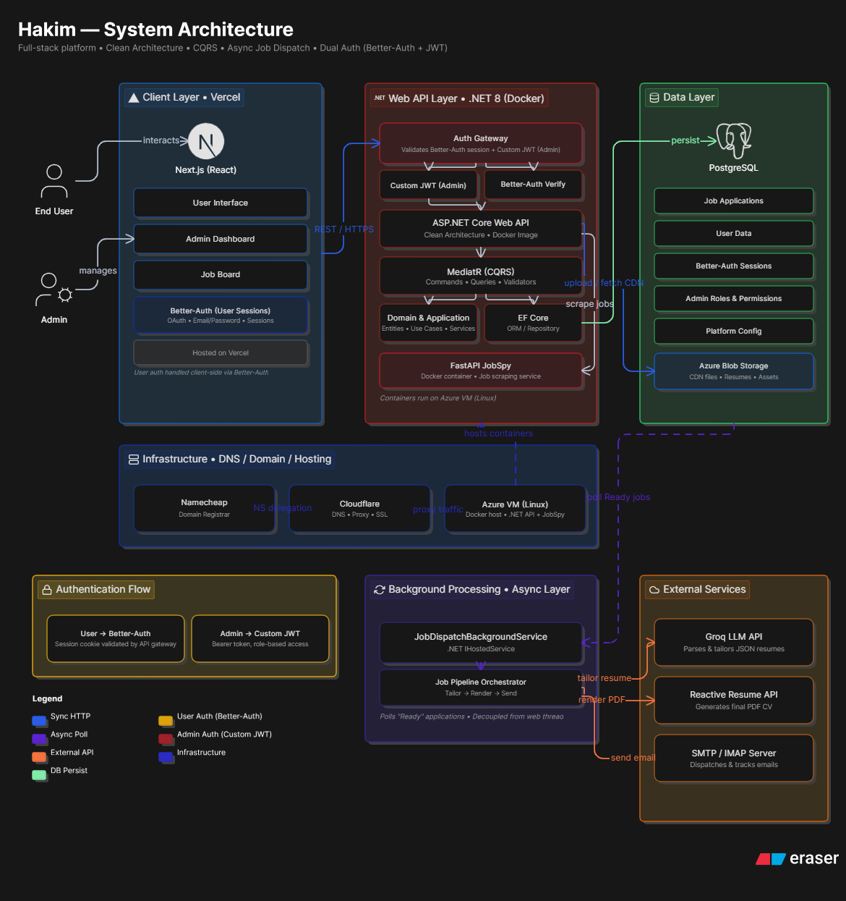
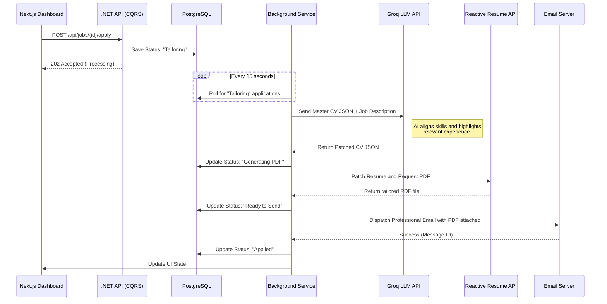

  <h1>Hakim Platform Architecture</h1>
  
<strong>A Deep-Dive into an Automated Workflow and Job Application Engine</strong>

  
<a href="https://abdullahhakim.me">Live Project: abdullahhakim.me</a>

  
  
  
  
  
  

 

> **Note:** The core repository containing the business logic, secrets, and personal endpoints is **private**. This repository serves as an **architecture showcase**, detailing the system design, the complex technical decisions, and providing sanitized code snippets of the core engine.

---

## 1. Project Overview

**Hakim** is a comprehensive, full-stack personal platform built to manage my digital presence, blog, and to **automate the tedious process of applying for software engineering roles.**

Instead of building a simple portfolio, I engineered a system that mimics real-world enterprise environments. The core feature of this platform is the **Automated Job Application Pipeline**—a resilient system that uses LLMs to dynamically tailor my CV to specific job descriptions, generates a PDF, and dispatches it to recruiters asynchronously.

---

## 2. High-Level System Architecture

The platform is designed with a strict separation of concerns, decoupling the high-performance UI/API layer from the heavy background processing layer.

---

## 3. Core Architectural Patterns

### 3.1 Clean Architecture and Domain-Driven Design (DDD)
The backend is structured using Clean Architecture to ensure business rules are isolated from UI and infrastructure concerns. 
- **Domain Layer:** Contains entities, value objects, and enums (e.g., `JobApplicationStatus`).
- **Application Layer:** Contains MediatR Commands/Queries, Validators, and DTOs.
- **Infrastructure Layer:** Handles external API calls (Groq, Reactive Resume), Email services, and Background Workers.
- **API Layer:** Thin controllers acting purely as endpoints.

### 3.2 CQRS (Command Query Responsibility Segregation)
Using **MediatR**, every action in the system is separated into a `Command` (writes) or a `Query` (reads). 
This allowed me to implement global **Validation Behaviors** (using FluentValidation) to intercept requests before they even hit the handler, ensuring pristine data integrity.

### 3.3 Background Dispatcher and Resilience (`IHostedService`)
Generating a PDF via an external API and sending an email can take up to 10 seconds. Doing this on the main HTTP thread would result in terrible UI latency and potential timeouts.
- I implemented a `.NET BackgroundService` that runs independently of web requests.
- When an application is triggered, the API simply updates the database state to `Processing` and immediately returns `202 Accepted` to the frontend.
- The background worker picks up the job, processes the LLM prompt, generates the PDF, and sends the email.
- **Graceful Degradation:** If the Reactive Resume API goes down, the background service safely flags the application as `ManualApplyRequired` rather than crashing the system.

---

## 4. The "Auto-Apply" Workflow Pipeline

The core engine of this architecture is the automated application pipeline. Here is exactly how the system handles a job application from click to dispatch:

---

## 5. Peek Inside the Code (Snippets)

Because the repository is private, I have included sanitized snippets in the [`/Snippets`](./Snippets) directory to demonstrate the coding standards, patterns, and complexity of the platform:

1. [**`JobDispatchBackgroundService.cs`**](./Snippets/JobDispatchBackgroundService.cs): Showcases the `IHostedService` implementation. Look at the structured logging, exception handling, and decoupled service scope factory injection.
2. [**`AutoApplyJobCommand.cs`**](./Snippets/AutoApplyJobCommand.cs): Demonstrates the MediatR Handler implementation. Notice how it strictly handles state transitions and defers heavy lifting to the background.
3. [**`JobApplicationsController.cs`**](./Snippets/JobApplicationsController.cs): Demonstrates thin API controllers utilizing MediatR to keep routing logic clean.
4. [**`GroqLlmService.cs`**](./Snippets/GroqLlmService.cs): Showcases resilient integration with external AI APIs using Typed HTTP Clients.
5. [**`JobApplication.cs`**](./Snippets/JobApplication.cs): Represents a Domain-Driven Design (DDD) entity encapsulating business rules and state representation.

---

## 6. Security and State Management
- **Authentication:** Custom JWT-based authentication bridging the Next.js frontend with the .NET Backend.
- **Role-Based Access:** Strict policy enforcement preventing unauthenticated users from triggering the `AutoApply` pipeline.
- **Concurrency Control:** Background services utilize specific locking mechanisms to prevent the same job application from being dispatched twice if polling intervals overlap.

---

## 7. Key Engineering Takeaways

Building this system from scratch provided deep experience with real-world enterprise engineering challenges:
- **Eventual Consistency:** Moving away from immediate HTTP responses to asynchronous, eventually consistent state updates.
- **External API Instability:** Learning how to build software that assumes external services (like LLMs or PDF generators) will fail, and designing fallbacks to ensure the user is still informed.
- **Strict Decoupling:** By adhering to Clean Architecture, swapping out the Groq LLM for OpenAI, or Resend for SendGrid, requires changing exactly one file in the Infrastructure layer, with zero changes to the Domain or Application layers.

---

### Let's Connect
I built this to showcase my readiness to tackle complex backend and full-stack challenges. If you are a recruiter or a senior engineer looking for someone passionate about clean code and system design, I invite you to connect.

- **Website:** [abdullahhakim.me](https://abdullahhakim.me)
- **LinkedIn:** [LinkedIn Connect](https://linkedin.com/in/abdullahhakimam)
